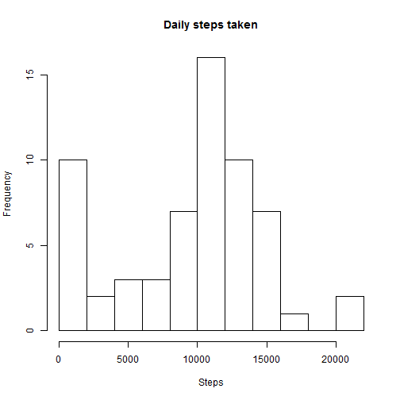
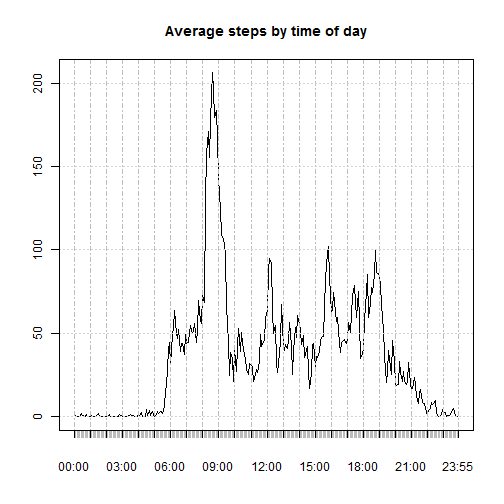
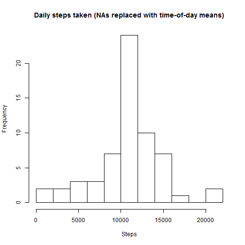
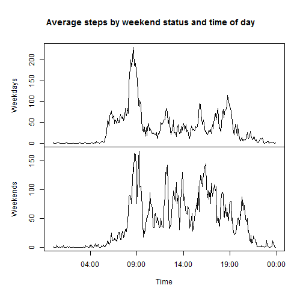

## 1) Loading and preprocessing the data


```r
library(xts)            # use the xts package, which facilitates time series
library(plyr)           # use the plyr package to efficiently summarize by group 
df.activity      <- read.csv("activity.csv")
df.activity$hour <- df.activity$interval %/% 100  # extract hour from interval 
df.activity$min  <- df.activity$interval %%  100  # extract minute from interval
df.activity$sNA  <- is.na(df.activity$steps)      
vdate            <- as.POSIXct(as.character(df.activity$date), tz="UTC")   
vdatetime        <- vdate + 3600 * df.activity$hour + 60 * df.activity$min 
df.activity$datetime <- vdatetime                 # POSIXct formatted date/time
Tsteps           <- xts(df.activity$steps, df.activity$datetime) # steps time series
```

## 2) What is mean total number of steps taken per day?

```r
Tstepsdaily <- apply.daily(Tsteps, sum, na.rm=TRUE)       # sum to daily time series, ignoring NA (per instructions)
hist(Tstepsdaily, main='Daily steps taken', xlab='Steps', breaks=10)
```

 

* The **mean** number of daily steps taken is **9354.23**

* The **median** is **10395**.

## 3) What is the average daily activity pattern?


```r
df.timeavg <- ddply(df.activity, ~interval, summarise, 
                    interval=unique(interval), hour=unique(hour), min=unique(min),
                    datetime=min(datetime), mean=mean(steps, na.rm=TRUE))
                                                 # average steps by time of day
Ttimeavg   <- xts(df.timeavg$mean, df.timeavg$datetime)   # convert to xts object
plot.xts(Ttimeavg, major.format="%H:%M", main="Average steps by time of day")
```

 

* On average across all days in the dataset, the **peak 5-minute interval** is the one
beginning at **08:35**.

## 4) Imputing missing values

* The total number of **missing step values** in the dataset is 
**2304** (which is
**13.11%** of the total.)

* The dataset contains 61 days of data.  

* Only
8
of these days contain missing data.  

* Therefore, a reasonable imputation strategy is to fill
in missing data with the appropriate 5-minute interval means.


```r
vmean               <- df.timeavg$mean 
names(vmean)        <- as.character(df.timeavg$interval)  # indexed time averages
df.activity$stepavg <- vmean[as.character(df.activity$interval)]
df.activity$stepimp <- df.activity$steps # imputed variable: baseline=non-imputed
df.activity$stepimp[df.activity$sNA] <- df.activity$stepavg[df.activity$sNA]
                                        # replace NAs with time-specific averages
Tstepsimp      <- xts(df.activity$stepimp, df.activity$datetime) # imputed series
Tstepsdailyimp <- apply.daily(Tstepsimp, sum)       # sum to daily time series
hist(Tstepsdailyimp, main='Daily steps taken (NAs replaced with time-of-day means)', xlab='Steps', breaks=10)
```

 

Using the **imputed data**:

* The **mean** number of daily steps taken is **10766.19**.

* The **median** is **10766.19**.

* Yes, the mean and median values above **do differ** 
from those of the non-imputed data.

    + For the **imputed** data, the days with all NA data are summarized with a total step value of the **daily mean**.

    + For the **non-imputed** data, the days with all NA data are summarized with a total step value of **0** (resulting from using na.rm=TRUE.)

* The **imputed method is preferable to the non-imputed method** because it is unlikely that the NA data days correspond to days in which the person actually walked zero steps.

* However, the **imputed method is not ideal**, because in adding "average days" to the data, **the sample variance is biased downward**.  


## 5) Are there differences in activity patterns between weekdays and weekends?

```r
# Define weekday/weekend factor
df.activity$dayofweek <- as.character(weekdays(df.activity$datetime))
df.activity$daytype   <- "Weekday"   #set default;  next line adjusts
df.activity$daytype[substr(df.activity$dayofweek,1,1)=="S"] <- "Weekend" 
df.activity$daytype   <- as.factor(df.activity$daytype)
# Determine time-specific averages for weekdays and weekends separately
df.timeavgWD <- ddply(subset(df.activity, daytype=="Weekday"), 
                      ~interval, summarise, datetime=min(datetime), 
                      Weekdays=mean(stepimp, na.rm=TRUE))
df.timeavgWE <- ddply(subset(df.activity, daytype=="Weekend"), 
                      ~interval, summarise, datetime=min(datetime), 
                      Weekends=mean(stepimp, na.rm=TRUE))
df.timeavgWDWE <- merge(df.timeavgWD, df.timeavgWE, by="interval")
# Define XTS time series object with both weekday and weekend averages
TtimeavgWDWE <- xts(df.timeavgWDWE[,c("Weekdays","Weekends")],
                    df.timeavgWDWE$datetime.x) # convert to xts
plot(as.zoo(TtimeavgWDWE), screens=c(1,2),
     xlab="Time", main="Average steps by weekend status and time of day")
```

 

Qualitative observations on the above plot:

* Before 8:00 -- fewer steps on weekends

* 10:00am to 10:00pm -- more steps on weekends

The data seem consistent with a person who works at a office/sedentary job 
on weekdays, and walks more on the weekends.
